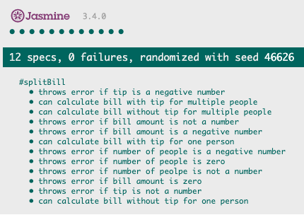
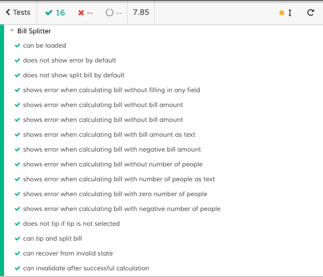

# Split the bill

## Description
A web application for splitting bill.

## User stories
```
As a User
I want to enter the bill amount
So that I can split the bill
```
```
As a User
I want to choose the quality of the service I recevied
So that I can add tip to the bill
```
```
As a User
I want to enter the number of people sharing the bill
So that I can see how much each person needs to pay
```

## Testing

The bill splitter module has been written in TDD and tested with Jasmine. To run the tests and generate a report, visit `./SpecRunner.html`



The User Interface has been tested with Cypress. To run the tests and generate a report, execute `$(npm bin)/cypress open`

